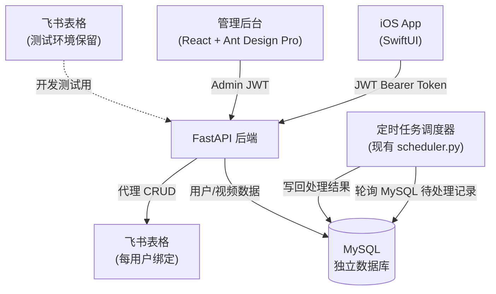
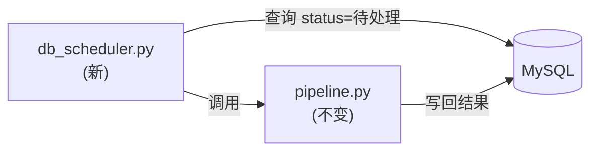

# 全栈后端与管理系统开发计划

## 整体架构




---

## 数据库设计（MySQL）

### `users` 表（账号信息，长期保留）

- `id`, `username`, `email`, `password_hash`
- `display_name`, `is_active`, `created_at`
- **不涉及飞书**，飞书只保留管理员自己的测试表格

### `videos` 表（视频处理记录，按策略定期清理）

- `id`, `user_id`（外键）
- `url`, `title`, `author`, `summary`（轻量字段，**永久保留**）
- `core_points`, `golden_sentences`, `tags`, `video_type`
- `corrected_text`（原始转录长文本，**定期清空**以节省空间）
- `status`（待处理 / 处理中 / 已完成 / 处理失败）
- `created_at`, `processed_at`, `error_msg`

### 视频数据自动清理策略

- `corrected_text` 等大字段：处理完成超过 **30 天**后自动置 NULL
- `url`、`title`、`summary`、`tags` 等结构化字段：**永久保留**，供 iOS 历史记录展示
- 管理后台提供"立即清理"按钮，可手动触发清理指定天数前的数据
- 清理只删内容，不删记录行（用户仍能看到历史条目的标题和摘要）

---

## 第一部分：FastAPI 后端（`backend/`）

```
backend/
├── main.py
├── database.py          # SQLAlchemy 连接 + 初始化
├── models.py            # User, Video ORM 模型
├── schemas.py           # Pydantic 请求/响应模型
├── auth.py              # JWT 签发 / 验证 / 密码哈希
├── feishu_client.py     # 飞书 API 封装（仅供管理员测试用，非用户流程）
├── routers/
│   ├── auth.py          # 注册 / 登录
│   ├── videos.py        # 用户视频 CRUD
│   └── admin.py         # 管理员专用接口
├── requirements.txt
└── Dockerfile
```

### 用户接口


| 方法   | 路径               | 说明                            |
| ---- | ---------------- | ----------------------------- |
| POST | `/auth/register` | 开放注册，账号信息写入 MySQL，与飞书无关       |
| POST | `/auth/login`    | 登录，返回 JWT                     |
| GET  | `/auth/me`       | 当前用户信息                        |
| POST | `/videos/submit` | 提交视频 URL，写入 MySQL（status=待处理） |
| GET  | `/videos`        | 分页查询当前用户视频列表                  |
| GET  | `/videos/{id}`   | 视频详情                          |
| GET  | `/videos/stats`  | 视频类型统计                        |


### 管理员接口（需 Admin JWT）


| 方法   | 路径                      | 说明                                              |
| ---- | ----------------------- | ----------------------------------------------- |
| GET  | `/admin/users`          | 用户列表（分页、搜索）                                     |
| POST | `/admin/users`          | 手动创建用户                                          |
| PUT  | `/admin/users/{id}`     | 修改用户（禁用/启用）                                     |
| GET  | `/admin/videos/pending` | 全局待处理视频队列                                       |
| GET  | `/admin/stats`          | 总览统计（用户数、视频数、今日处理量）                             |
| GET  | `/admin/api-balance`    | 查询各 AI 提供商余额（复用 `utils/api_balance_checker.py`） |


---

## 第二部分：定时任务调度器改造

**改动最小化原则**：保留 `[core/scheduler.py](core/scheduler.py)` 的核心逻辑，只改数据源。

- 新增 `core/db_scheduler.py`：从 MySQL 轮询 `status=待处理` 的记录，处理完后写回结果
- 原有 `core/scheduler.py`（飞书版）保留，用于测试环境




---

## 第三部分：React 管理后台（`admin-web/`）

技术栈：**React 18 + Ant Design Pro + TypeScript**

```
admin-web/
├── src/
│   ├── pages/
│   │   ├── Dashboard/       # 总览：用户数、视频数、今日处理、API余额
│   │   ├── Users/           # 用户管理：列表、创建、禁用
│   │   ├── Videos/          # 待处理队列、全局视频列表
│   │   └── Settings/        # 系统配置（AI提供商、调度间隔）
│   ├── services/            # API 请求封装
│   └── layouts/             # 侧边栏导航
```

### 管理后台页面功能

**Dashboard（总览）**

- 用户总数 / 今日新增
- 视频总数 / 今日处理 / 待处理队列长度
- AI API 余额（OpenAI / Kimi / Gemini）实时查询
- 近 7 天处理量折线图

**用户管理**

- 用户列表（搜索、分页）
- 查看单个用户的视频数量、注册时间
- 禁用 / 启用账号

**待处理队列**

- 全局视频处理队列（所有用户的待处理记录）
- 显示提交时间、URL、所属用户
- 支持手动触发重新处理

---

## 第四部分：iOS App 切换

新建两个文件（View 层零改动）：

- `[ios_app/.../Services/ServerVideoRepository.swift](ios_app/iOS_Video_Intelligence/Services/ServerVideoRepository.swift)`
- `[ios_app/.../Services/ServerAuthService.swift](ios_app/iOS_Video_Intelligence/Services/ServerAuthService.swift)`

修改 `[ios_app/.../Services/AppConfig.swift](ios_app/iOS_Video_Intelligence/Services/AppConfig.swift)`：

```swift
static let useFeishuDirect = false
enum Server {
    static let baseURL = "https://your-server.com/api"
}
```

---

## 执行顺序与估时

### 阶段一：本地开发与联调（先跑通，再上线）


| 步骤  | 内容                                                   | 估时    |
| --- | ---------------------------------------------------- | ----- |
| 1   | FastAPI 骨架 + 本地 MySQL 建表 + 用户注册登录                    | 1 天   |
| 2   | 视频 CRUD 接口（数据存本地 MySQL）                              | 0.5 天 |
| 3   | 管理员接口（用户管理 + 队列 + 余额查询）                              | 0.5 天 |
| 4   | 定时任务改造（db_scheduler.py，轮询本地 MySQL）                   | 0.5 天 |
| 5   | React 管理后台（Dashboard + 用户 + 队列）                      | 2 天   |
| 6   | iOS App 新增 ServerVideoRepository，指向本地 127.0.0.1:8000 | 0.5 天 |
| 7   | 本地全流程联调（iOS → FastAPI → MySQL → 调度器 → 回写）            | 0.5 天 |


**本地阶段合计约 5.5 天**

### 阶段二：云端部署（本地联调完成后）


| 步骤  | 内容                                                  | 估时    |
| --- | --------------------------------------------------- | ----- |
| 8   | 编写 Dockerfile + docker-compose.yml（FastAPI + MySQL） | 0.5 天 |
| 9   | 部署到云服务器，配置环境变量、域名、HTTPS                             | 0.5 天 |
| 10  | iOS App 切换 baseURL 到线上地址，回归测试                       | 0.5 天 |


**部署阶段合计约 1.5 天**