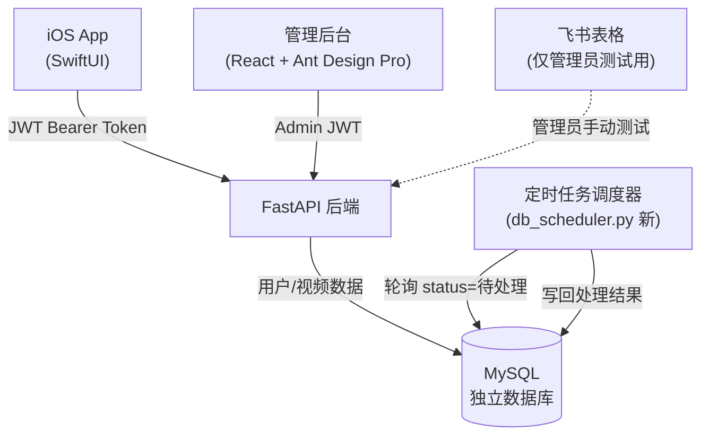
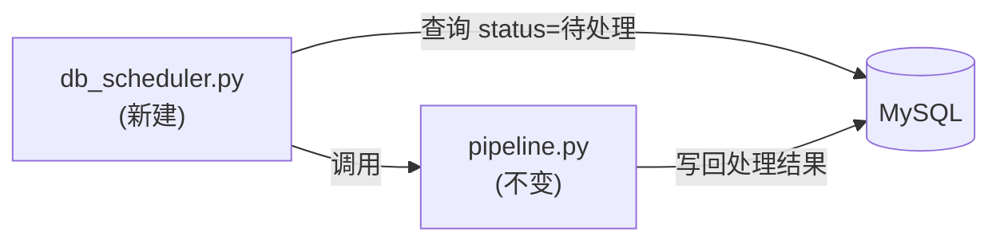

# 全栈后端与管理系统开发计划

> 创建时间：2026-03-12  
> 状态：待执行

---

## 概述

开发 FastAPI 后端（MySQL 独立数据库）+ React 管理后台，支持多用户开放注册；飞书表格仅保留管理员自己的测试表格，与普通用户账号无关；定时任务调度器保留现有逻辑，改为从 MySQL 轮询；本地联调跑通后再部署到云服务器。

---

## 整体架构



---

## 数据库设计（MySQL）

### `users` 表（账号信息，长期保留）

- `id`, `username`, `email`, `password_hash`
- `display_name`, `is_active`, `created_at`
- **不涉及飞书**，飞书只保留管理员自己的测试表格

### `videos` 表（视频处理记录，按策略定期清理）

- `id`, `user_id`（外键）
- `url`, `title`, `author`, `summary`（轻量字段，**永久保留**）
- `core_points`, `golden_sentences`, `tags`, `video_type`
- `corrected_text`（原始转录长文本，**定期清空**以节省空间）
- `status`（待处理 / 处理中 / 已完成 / 处理失败）
- `created_at`, `processed_at`, `error_msg`

### 视频数据自动清理策略

- `corrected_text` 等大字段：处理完成超过 **30 天**后自动置 NULL
- `url`、`title`、`summary`、`tags` 等结构化字段：**永久保留**，供 iOS 历史记录展示
- 管理后台提供"立即清理"按钮，可手动触发清理指定天数前的数据
- 清理只删内容，不删记录行（用户仍能看到历史条目的标题和摘要）

---

## 第一部分：FastAPI 后端（`backend/`）

```
backend/
├── main.py
├── database.py          # SQLAlchemy 连接 + 初始化（本地 .env 配置 MySQL）
├── models.py            # User, Video ORM 模型
├── schemas.py           # Pydantic 请求/响应模型
├── auth.py              # JWT 签发 / 验证 / 密码哈希（bcrypt）
├── feishu_client.py     # 飞书 API 封装（仅供管理员测试用，非用户流程）
├── routers/
│   ├── auth.py          # 注册 / 登录
│   ├── videos.py        # 用户视频 CRUD
│   └── admin.py         # 管理员专用接口
├── requirements.txt
└── Dockerfile           # 本地联调完成后编写
```

### 用户接口

| 方法 | 路径 | 说明 |
|------|------|------|
| POST | `/auth/register` | 开放注册，账号信息写入 MySQL，与飞书无关 |
| POST | `/auth/login` | 登录，返回 JWT |
| GET | `/auth/me` | 当前用户信息 |
| POST | `/videos/submit` | 提交视频 URL，写入 MySQL（status=待处理） |
| GET | `/videos` | 分页查询当前用户视频列表 |
| GET | `/videos/{id}` | 视频详情 |
| GET | `/videos/stats` | 视频类型统计 |

### 管理员接口（需 Admin JWT）

| 方法 | 路径 | 说明 |
|------|------|------|
| GET | `/admin/users` | 用户列表（分页、搜索） |
| POST | `/admin/users` | 手动创建用户 |
| PUT | `/admin/users/{id}` | 修改用户（禁用/启用） |
| GET | `/admin/videos/pending` | 全局待处理视频队列 |
| GET | `/admin/stats` | 总览统计（用户数、视频数、今日处理量） |
| GET | `/admin/api-balance` | 查询各 AI 提供商余额（复用 `utils/api_balance_checker.py`） |
| POST | `/admin/cleanup` | 手动触发清理指定天数前的 corrected_text |

---

## 第二部分：定时任务调度器改造

**改动最小化原则**：保留 `core/scheduler.py` 的核心逻辑，只改数据源。

- 新增 `core/db_scheduler.py`：从 MySQL 轮询 `status=待处理` 的记录，调用现有 `pipeline.py` 处理，写回结果
- 原有 `core/scheduler.py`（飞书版）**保留不动**，用于管理员测试环境



---

## 第三部分：React 管理后台（`admin-web/`）

技术栈：**React 18 + Ant Design Pro + TypeScript**

```
admin-web/
├── src/
│   ├── pages/
│   │   ├── Dashboard/       # 总览：用户数、视频数、今日处理、API余额
│   │   ├── Users/           # 用户管理：列表、创建、禁用/启用
│   │   ├── Videos/          # 待处理队列、全局视频列表、手动重处理
│   │   └── Settings/        # 数据清理、系统配置
│   ├── services/            # API 请求封装（axios）
│   └── layouts/             # 侧边栏导航
```

### 各页面功能详情

**Dashboard（总览）**
- 用户总数 / 今日新增
- 视频总数 / 今日处理 / 待处理队列长度
- AI API 余额（OpenAI / Kimi / Gemini）实时查询卡片
- 近 7 天处理量折线图

**用户管理**
- 用户列表（搜索、分页）
- 查看单个用户的视频数量、注册时间
- 禁用 / 启用账号

**待处理队列**
- 全局视频处理队列（所有用户的待处理记录）
- 显示提交时间、URL、所属用户、当前状态
- 支持手动触发重新处理失败记录

**数据清理（Settings）**
- 设置自动清理天数阈值（默认 30 天）
- 手动触发"立即清理"按钮
- 显示预计可释放空间

---

## 第四部分：iOS App 切换

新建两个文件（View 层零改动）：
- `ios_app/iOS_Video_Intelligence/Services/ServerVideoRepository.swift`
- `ios_app/iOS_Video_Intelligence/Services/ServerAuthService.swift`

修改 `ios_app/iOS_Video_Intelligence/Services/AppConfig.swift`：

```swift
static let useFeishuDirect = false   // 改这一行
enum Server {
    static let baseURL = "http://127.0.0.1:8000"  // 本地联调阶段
    // 上线后改为: "https://your-server.com/api"
}
```

修改 `AppServices.swift` 依赖注入，根据 `useFeishuDirect` 选择实现类，**View 层代码零改动**。

---

## 执行顺序与估时

### 阶段一：本地开发与联调

| 步骤 | 内容 | 估时 |
|------|------|------|
| 1 | FastAPI 骨架 + 本地 MySQL 建表 + 用户注册登录 | 1 天 |
| 2 | 视频 CRUD 接口（数据存本地 MySQL） | 0.5 天 |
| 3 | 管理员接口（用户管理 + 队列 + 余额查询 + 数据清理） | 0.5 天 |
| 4 | 定时任务改造（db_scheduler.py，轮询本地 MySQL） | 0.5 天 |
| 5 | React 管理后台（Dashboard + 用户 + 队列 + 清理） | 2 天 |
| 6 | iOS App 新增 ServerVideoRepository，指向本地 127.0.0.1:8000 | 0.5 天 |
| 7 | 本地全流程联调（iOS → FastAPI → MySQL → 调度器 → 回写） | 0.5 天 |

**本地阶段合计约 5.5 天**

### 阶段二：云端部署（本地联调完成后）

| 步骤 | 内容 | 估时 |
|------|------|------|
| 8 | 编写 Dockerfile + docker-compose.yml（FastAPI + MySQL） | 0.5 天 |
| 9 | 部署到云服务器，配置环境变量、域名、HTTPS | 0.5 天 |
| 10 | iOS App 切换 baseURL 到线上地址，回归测试 | 0.5 天 |

**部署阶段合计约 1.5 天**

---

## 任务清单

| ID | 内容 | 状态 |
|----|------|------|
| backend-scaffold | FastAPI 骨架 + MySQL 建表 + 环境配置 | 🔲 待执行 |
| auth-endpoints | 用户注册 / 登录 / 个人信息接口 | 🔲 待执行 |
| video-endpoints | 视频提交 / 列表 / 详情 / 统计接口 | 🔲 待执行 |
| admin-endpoints | 管理员接口（用户、队列、余额、清理） | 🔲 待执行 |
| db-scheduler | 新建 db_scheduler.py，轮询 MySQL 处理视频 | 🔲 待执行 |
| react-admin | React 管理后台（Dashboard + 用户 + 队列） | 🔲 待执行 |
| ios-server-repo | iOS ServerVideoRepository + ServerAuthService | 🔲 待执行 |
| local-debug | 本地全流程联调 | 🔲 待执行 |
| deploy | Dockerfile + 云服务器部署 | 🔲 待执行（最后） |
